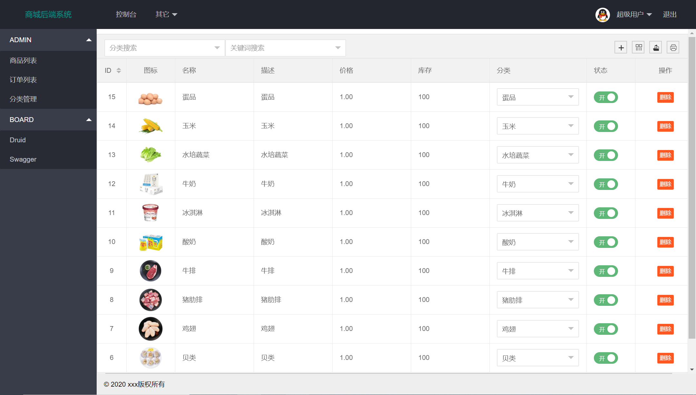
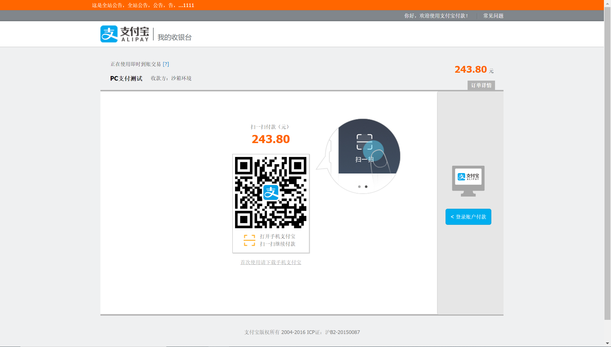

# mall

## 前端技术
[web-layui](/web-layui)
1. [Layui](https://www.layui.com/)
2. [模板](https://fly.layui.com/store/layuiMaternalBabyMall/)
3. :smile: ! 注意config.js文件，全局配置




## 后端技术
| 技术 | 说明 |
| ---- | ---- |
| [Spring Framework](https://github.com/spring-projects/spring-framework) | IoC(控制反转)、AOP(面向切面) |
| [Spring Boot](https://github.com/spring-projects/spring-boot) | MVC框架 |
| [Spring Security](https://github.com/spring-projects/spring-security) | 安全框架 |
| [JWT](https://github.com/jwtk/jjwt) | 单点登录 |
| [Druid](https://github.com/alibaba/druid/) | 数据库连接池 |
| [MyBatis](https://github.com/mybatis/mybatis-3) | 数据库框架  |
| [MyBatis Plus](https://github.com/baomidou/mybatis-plus) | 数据库增强框架 |
| [MySQL](https://github.com/mysql/mysql-server) | 关系型数据库 |
| [Redis](https://github.com/antirez/redis) | 缓存型数据库 |
| [RocketMQ](https://github.com/apache/rocketmq) | 消息队列 |
| [QiNiu](https://github.com/qiniu/java-sdk) | 对象存储 |
| [Swagger](https://github.com/swagger-api/swagger-ui) | 文档接口 |
| [LogStash](https://github.com/elastic/logstash) | 日志收集 |
| [Hutool](https://github.com/looly/hutool) | Java工具类库 |
| [Lombok](https://github.com/rzwitserloot/lombok) | 简化对象封装工具（需要安装IDEA插件） |

## 结构
mall:  
----mall-mbg: 数据库生成  
----mall-common: 基础模块  
----mall-security: 用户认证  
----mall-app: 商城后端开发  
----mall-admin: 管理后端开发

## 启动
>* app: Run AppApplication.java http://localhost:8080/
>* admin: Run AdminApplication.java http://localhost:8081/
>* app Druid: http://localhost:8080/druid/index.html
>* admin Druid: http://localhost:8081/druid/index.html
>* app Swagger: http://localhost:8080/swagger-ui.html
>* admin Swagger: http://localhost:8081/swagger-ui.html

## 支付宝沙箱
>* https://github.com/littleredhat1997/pay-demo
>* https://openhome.alipay.com/platform/appDaily.htm
>* [alipay.trade.page.pay(统一收单下单并支付页面接口)](https://opendocs.alipay.com/apis/api_1/alipay.trade.page.pay)
>* [alipay.trade.refund(统一收单交易退款接口)](https://opendocs.alipay.com/apis/api_1/alipay.trade.refund)
>* [alipay.trade.close(统一收单交易关闭接口)](https://opendocs.alipay.com/apis/api_1/alipay.trade.close)
>* [alipay.trade.cancel(统一收单交易撤销接口)](https://opendocs.alipay.com/apis/api_1/alipay.trade.cancel)
>* [alipay.trade.query(统一收单线下交易查询)](https://opendocs.alipay.com/apis/api_1/alipay.trade.query)



```
# 内网穿透
$ ssh -NR 8888:127.0.0.1:8080 root@www.littleredhat1997.com

# 保持连接
$ vim /etc/ssh/sshd_config
+ ClientAliveInterval 60
+ ClientAliveCountMax 10
```

## MySQL
1. 安装（略，或直接安装[LNMP](https://lnmp.org/)）

2. 配置外网访问
```
$ vim /etc/my.cnf
+ [mysqld]
+ port = 3306
+ bind-address = 0.0.0.0

$ mysql -u root -p
mysql> GRANT ALL PRIVILEGES ON *.* TO 'root'@'%' IDENTIFIED BY '123456'; 
mysql> FLUSH PRIVILEGES;
```

3. 启动/关闭
```
$ service mysql start
$ service mysql stop
```

## Redis
1. 安装
```
$ yum install redis
```

2. 配置外网访问
```
$ vim /etc/redis.conf
+ bind 127.0.0.1         ----> # bind 127.0.0.1
+ protected-mode yes     ----> protected-mode no
+ # requirepass foobared ----> requirepass 123456
+ daemonize no           ----> daemonize yes
```

3. 启动/关闭
```
$ redis-server 或者 ($ redis-server /etc/redis.conf)
$ redis-cli shutdown
```

## RocketMQ
1. 安装
```
$ wget https://archive.apache.org/dist/rocketmq/4.7.0/rocketmq-all-4.7.0-bin-release.zip
$ unzip rocketmq-all-4.7.0-bin-release.zip
$ mv rocketmq-all-4.7.0-bin-release rocketmq
$ mv rocketmq /usr/local

$ vim /etc/profile
+ export PATH=$PATH:/usr/local/rocketmq/bin
+ export NAMESRV_ADDR=localhost:9876

$ source /etc/profile
```

2. 启动/关闭
```
$ mqnamesrv &
$ mqbroker -n localhost:9876 &

$ mqshutdown broker
$ mqshutdown namesrv

# 外网访问
$ vim /usr/local/rocketmq/conf/broker.conf
+ namesrvAddr=www.littleredhat1997.com:9876
+ brokerIP1=www.littleredhat1997.com

# 后台运行
$ nohup mqnamesrv &
$ nohup mqbroker -c /usr/local/rocketmq/conf/broker.conf &
```

3. 报错解决
```
OpenJDK 64-Bit Server VM warning: INFO: os::commit_memory(0x00000005c0000000, 8589934592, 0) failed; error='Cannot allocate memory' (errno=12)

$ cd /usr/local/rocketmq/bin/

$ vim runserver.sh
- JAVA_OPT="${JAVA_OPT} -server -Xms4g -Xmx4g -Xmn2g -XX:MetaspaceSize=128m -XX:MaxMetaspaceSize=320m"
+ JAVA_OPT="${JAVA_OPT} -server -Xms128m -Xmx128m -Xmn128m -XX:MetaspaceSize=128m -XX:MaxMetaspaceSize=128m"

$ vim runbroker.sh
- JAVA_OPT="${JAVA_OPT} -server -Xms8g -Xmx8g -Xmn4g"
+ JAVA_OPT="${JAVA_OPT} -server -Xms128m -Xmx128m -Xmn128m"
```

## Tomcat
1. 安装
```
$ wget http://mirrors.tuna.tsinghua.edu.cn/apache/tomcat/tomcat-9/v9.0.30/bin/apache-tomcat-9.0.30.tar.gz
$ tar -zxvf apache-tomcat-9.0.30.tar.gz
$ mv apache-tomcat-9.0.30 tomcat
$ mv tomcat /usr/local
```

2. 启动/关闭
```
$ cd /usr/local/tomcat
$ ./bin/start.sh
$ ./bin/stop.sh
```

## 端口开放
```
# 修改端口
$ vim /etc/sysconfig/iptables
# 重启端口
$ service iptables restart
# 查看端口
$ iptables -L -n
```

## Spring Security
```
Filter -> Interceptor -> Aspect -> Controller
OncePerRequestFilter 重复执行的filter只需要一次执行

1. AbstractUserDetailsAuthenticationProvider.java
     private class DefaultPostAuthenticationChecks implements UserDetailsChecker
         -> isAccountNonLocked() -> isEnabled() -> isAccountNonExpired()
2. DaoAuthenticationProvider.java
     protected void additionalAuthenticationChecks
         -> check username and password
3. AbstractUserDetailsAuthenticationProvider.java
     private class DefaultPreAuthenticationChecks implements UserDetailsChecker
         -> isCredentialsNonExpired()

USERNAME_NOT_FOUND(1004, "认证失败：用户名不存在"),
BAD_CREDENTIALS(1005, "认证失败：密码错误"),
ACCOUNT_DISABLED(1006, "认证失败：用户不可用"),
ACCOUNT_LOCKED(1007, "认证失败：用户锁定"),
ACCOUNT_EXPIRED(1008, "认证失败：用户过期"),
CREDENTIALS_EXPIRED(1009, "认证失败：证书过期"),
```

## 压力测试
[JMeter](https://jmeter.apache.org/download_jmeter.cgi)

| 项目 | QPS | Time |
| :----: | :----: | :----: |
| MySQL | 200 | ≈2s |
| Redis | 5000 | <10ms |
| 其他说明 | CPU8核16线程 | 内存16G*2 |

## 参考链接
>* Spring Boot博客：https://github.com/ityouknow/spring-boot-examples
>* Spring Boot项目：https://github.com/macrozheng/mall
>* Xshell 6 免费：https://www.netsarang.com/zh/free-for-home-school
>* Navicat Premium 12 破解：https://www.52pojie.cn/thread-952490-1-1.html