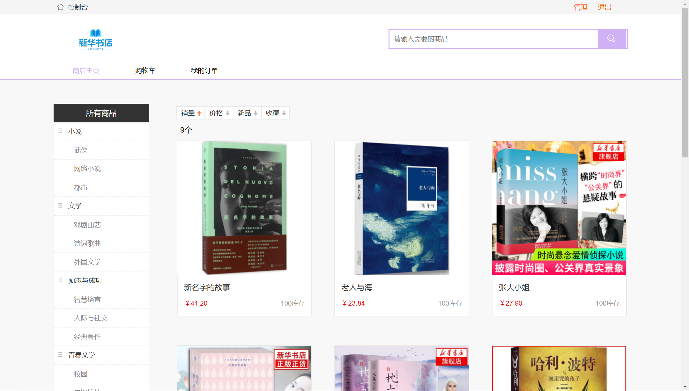
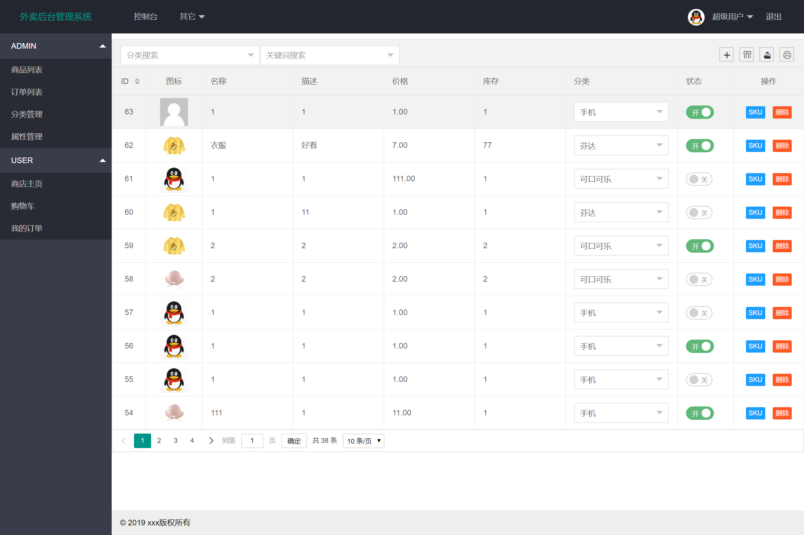

# mall

## 前端技术
[sell-layui](/sell-layui)
1. [Layui](https://www.layui.com/)
2. [模板](https://fly.layui.com/store/layuiMaternalBabyMall/)
3. :smile: ! 注意config.js文件，全局配置





## 后端技术
| 技术 | 说明 |
| ---- | ---- |
| [Spring Framework](https://github.com/spring-projects/spring-framework) | IoC(控制反转)、AOP(面向切面) |
| [Spring Boot](https://github.com/spring-projects/spring-boot) | MVC框架 |
| [Spring Security](https://github.com/spring-projects/spring-security) | 安全框架 |
| [JWT](https://github.com/jwtk/jjwt) | 单点登录 |
| [MyBatis](https://github.com/mybatis/mybatis-3) | 数据库框架  |
| [MyBatis Generator](https://github.com/mybatis/generator) | MyBatis生成插件 |
| [MyBatis PageHelper](https://github.com/pagehelper/Mybatis-PageHelper) | MyBatis分页插件 |
| [Redis](https://github.com/antirez/redis) | key-value数据库 |
| [Redisson](https://github.com/redisson/redisson) | 分布式锁 |
| [RabbitMQ](https://github.com/rabbitmq/rabbitmq-server) | 消息队列 |
| [QiNiu](https://github.com/qiniu/java-sdk) | 对象存储 |
| [Druid](https://github.com/alibaba/druid/) | 数据库连接池 |
| [Swagger](https://github.com/swagger-api/swagger-ui) | 文档接口 |
| [LogStash](https://github.com/elastic/logstash) | 日志收集 |
| [Lombok](https://github.com/rzwitserloot/lombok) | 简化对象封装工具（需要安装IDEA插件） |
| [Hutool](https://github.com/looly/hutool) | Java工具类库 |
| [EasyCaptcha](https://github.com/whvcse/EasyCaptcha) | 验证码

## 结构
mall:  
----mall-mbg: MyBatis Generator  
----mall-common: 基础模块  
----mall-auth: 用户认证  
----mall-admin: 管理后端开发  
----mall-app: 商城后端开发

## 启动
MyBatis Generator:
>* 数据库建表 demo.sql -> 生成MBG Generator.java
>* MySQL5.7 支持双timestamp
>* OrderMaster表主键不自增，由Snowflake雪花算法生成

mall-admin: Run AdminApplication.java http://localhost:8081/

mall-app: Run AppApplication.java http://localhost:8080/

Druid: http://localhost:808x/druid/index.html

Swagger: http://localhost:808x/swagger-ui.html

## 支付宝沙箱
>* https://github.com/littleredhat1997/pay-demo
>* https://openhome.alipay.com/platform/appDaily.htm
>* https://docs.open.alipay.com/284


```
$ ssh -NR 8888:127.0.0.1:8080 root@www.littleredhat1997.com

# 保持连接
$ vim /etc/ssh/sshd_config
ClientAliveInterval 60
ClientAliveCountMax 10
```

## MySQL
1. 安装（略，或直接安装[LNMP](https://lnmp.org/)）

2. 配置外网访问
```
$ vim /etc/my.cnf

[mysqld]
port = 3306
bind-address = 0.0.0.0

$ mysql -u root -p

mysql> GRANT ALL PRIVILEGES ON *.* TO 'root'@'%' IDENTIFIED BY '123456'; 
mysql> FLUSH PRIVILEGES;
```

3. 启动/关闭
```
$ service mysql start
$ service mysql stop
```

## Redis
1. 安装
```
$ yum install redis
```

2. 配置外网访问
```
$ vim /etc/redis.conf

bind 127.0.0.1         ----> # bind 127.0.0.1
protected-mode yes     ----> protected-mode no
# requirepass foobared ----> requirepass 123456
daemonize no           ----> daemonize yes
```

3. 启动/关闭
```
$ redis-server 或者 ($ redis-server /etc/redis.conf)
$ redis-cli shutdown
```

## RabbitMQ
1. 安装
```
$ wget https://www.rabbitmq.com/releases/erlang/erlang-19.0.4-1.el7.centos.x86_64.rpm
$ wget https://www.rabbitmq.com/releases/rabbitmq-server/v3.6.15/rabbitmq-server-3.6.15-1.el7.noarch.rpm
$ rpm -ivh erlang-19.0.4-1.el7.centos.x86_64.rpm
$ rpm -ivh rabbitmq-server-3.6.15-1.el7.noarch.rpm
$ yum install socat
```

2. 启动/关闭
```
$ service rabbitmq-server start
$ service rabbitmq-server stop
```

3. 开启web插件
```
$ rabbitmq-plugins enable rabbitmq_management

localhost:15672

# 创建用户
Admin ----> Add a user ----> Username , Password and Tags(Admin)
# 外网访问
Admin ----> All users ----> Set permission
```

## Tomcat
1. 安装
```
$ wget http://mirrors.tuna.tsinghua.edu.cn/apache/tomcat/tomcat-9/v9.0.30/bin/apache-tomcat-9.0.30.tar.gz
$ tar -zxvf apache-tomcat-9.0.30.tar.gz
$ mv apache-tomcat-9.0.30.tar.gz tomcat
$ mv tomcat /usr/local
```

2. 启动/关闭
```
$ cd /usr/local/tomcat
$ ./bin/start.sh
$ ./bin/stop.sh
```

## 端口开放
```
# 修改端口
$ vim /etc/sysconfig/iptables
# 重启端口
$ service iptables restart
# 查看端口
$ iptables -L -n
```

## Spring Security
1. AOP 顺序
```
Filter -> Interceptor -> Aspect -> Controller
OncePerRequestFilter 重复执行的filter只需要一次执行
```

2. AuthenticationProvider 顺序
```
1. AbstractUserDetailsAuthenticationProvider.java
     private class DefaultPostAuthenticationChecks implements UserDetailsChecker
         -> isAccountNonLocked() -> isEnabled() -> isAccountNonExpired()
2. DaoAuthenticationProvider.java
     protected void additionalAuthenticationChecks
         -> check username and password
3. AbstractUserDetailsAuthenticationProvider.java
     private class DefaultPreAuthenticationChecks implements UserDetailsChecker
         -> isCredentialsNonExpired()

// base/Status.java
USERNAME_NOT_FOUND(1004, "认证失败：用户名不存在"),
BAD_CREDENTIALS(1005, "认证失败：密码错误"),
ACCOUNT_DISABLED(1006, "认证失败：用户不可用"),
ACCOUNT_LOCKED(1007, "认证失败：用户锁定"),
ACCOUNT_EXPIRED(1008, "认证失败：用户过期"),
CREDENTIALS_EXPIRED(1009, "认证失败：证书过期"),
```

3. UserDetailsService 缓存
```
// get
User user = (User) redisService.get(Constants.USER_KEY + username);
// set
redisService.set(Constants.USER_KEY + username, user, Constants.USER_EXPIRE);

// utils/Constants.java
public static final String USER_KEY = "user:"; // 用户缓存
public static final int USER_EXPIRE = 60 * 60; // 用户缓存过期时间 60*60s
public static final String ROLE_KEY = "role:"; // 角色缓存
public static final int ROLE_EXPIRE = 60 * 60; // 角色缓存过期时间 60*60s
public static final String PERMISSION_KEY = "permission:"; // 权限缓存
public static final int PERMISSION_EXPIRE = 60 * 60; // 权限缓存过期时间 60*60s
```

## 参考链接
>* Spring Boot博客：https://github.com/ityouknow/spring-boot-examples
>* Spring Boot项目：https://github.com/macrozheng/mall
>* Xshell 6 免费：https://www.netsarang.com/zh/free-for-home-school
>* Navicat Premium 12 破解：https://www.52pojie.cn/thread-952490-1-1.html